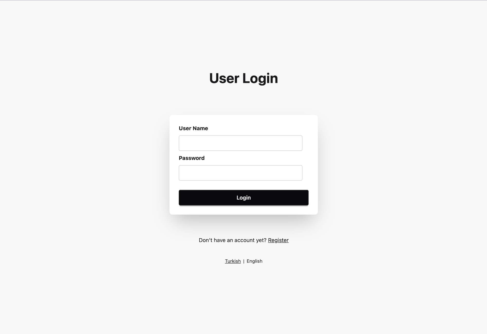
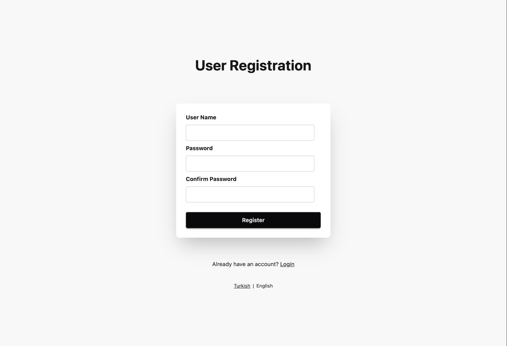
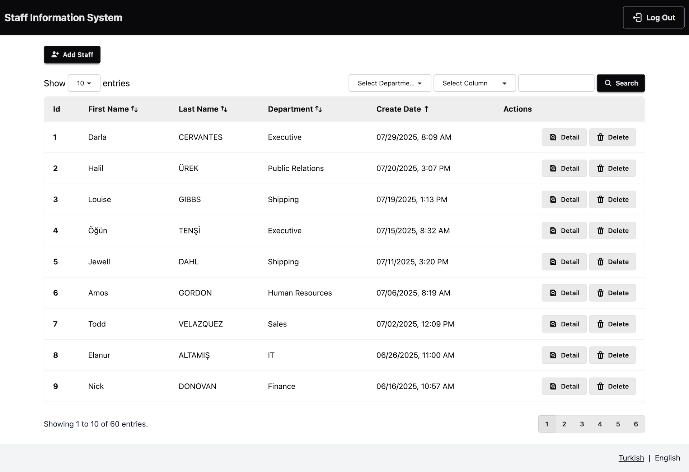
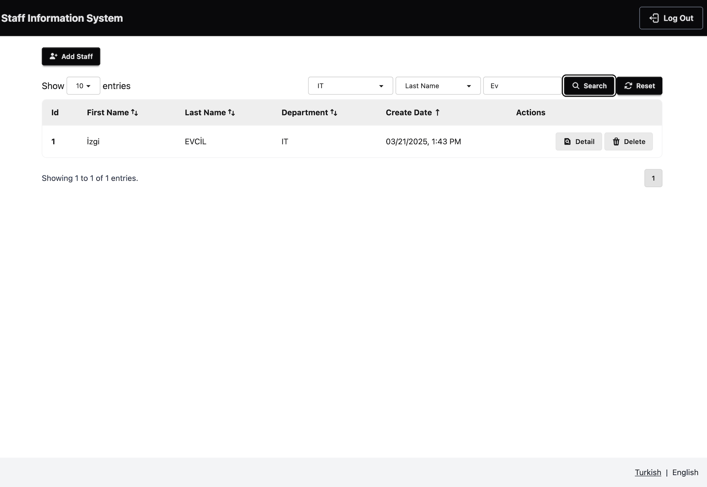
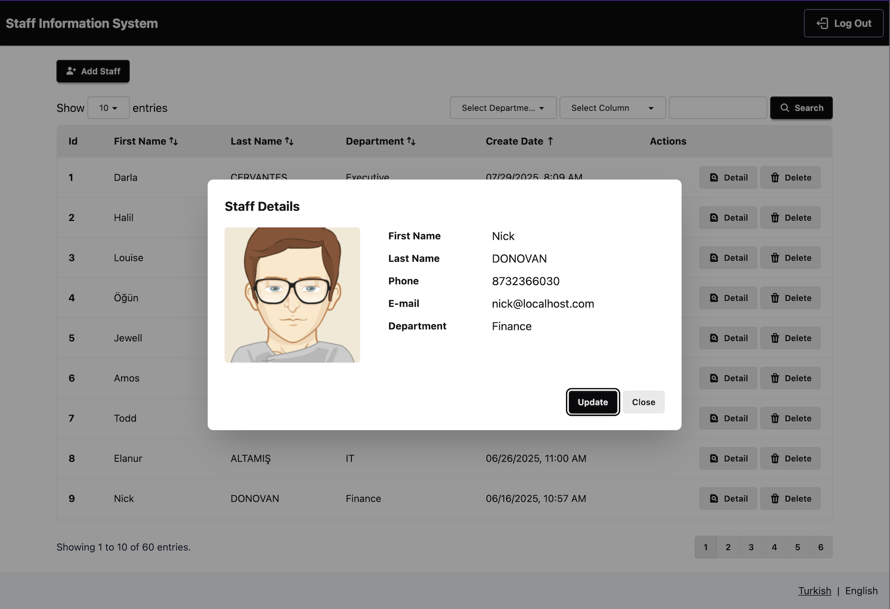
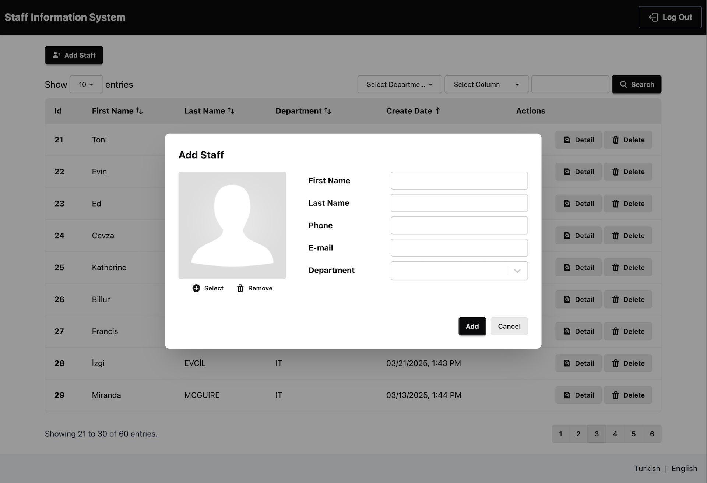
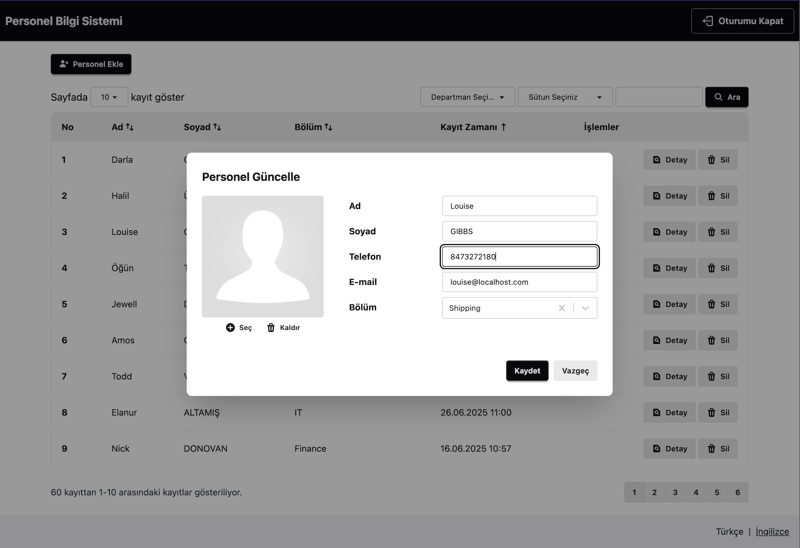
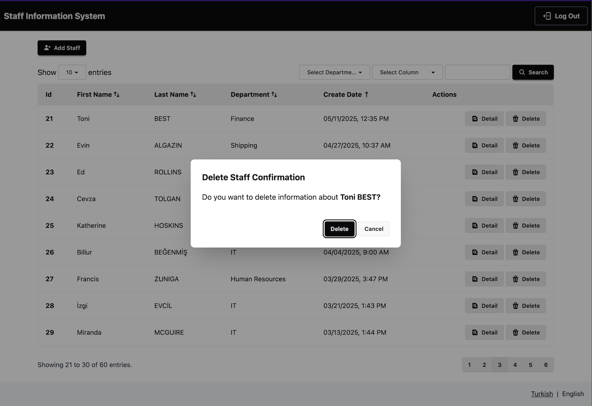

# Staff Management System

This project is developed to practise on MERN stack.

# Table Of Contents

- [Staff Management System](#staff-management-system)
- [Table Of Contents](#table-of-contents)
- [Technologies Used](#technologies-used)
- [Features](#features)
- [Screenshots](#screenshots)
- [Launch](#launch)
- [Usage](#usage)

# Technologies Used

- Node.js
- Express
- MongoDb
- Mongoose
- JWT
- Swagger
- Winston
- React
- Tailwind CSS
- DaisyUI
- React Hook Forms
- React-i18Next

# Features

- Register and Login user.
- Making staff releated CRUD operations.
- Adding, updating and deleting staff image.
- Listing staffs.
- Searching staff by first name, last name and department.
- Sorting list by First Name, Last Name, Department and Create Date.
- Turkish and English language support.

# Screenshots

<a href="./screenshots/user-login.png">
	
</a>

<a href="./screenshots/user-registration.png">
	
</a>

<a href="./screenshots/staff-list.png">
	
</a>

<a href="./screenshots/filter-results.png">
	
</a>

<a href="./screenshots/staff-details.png">
	
</a>

<a href="./screenshots/adding-staff.png">
	
</a>

<a href="./screenshots/updating-staff.png">
	
</a>

<a href="./screenshots/delete-confirmation.png">
	
</a>

> Staff names is not real names. They were randomly generated.

# Launch

To build and run project:

1. Clone project
	```bash
	$ git clone https://github.com/erhantuncel/Staff-Management-System-MERN.git
	```

2. Generate `.env` file with `envFileGenerator.js`
   
	> Before generate `.env` file, you should get a Cloudinary API key. If you don't set Cloudinary API key, you can not save and update Staff with image.

	
	```bash
	$ cd Staff-Management-System-MERN
	$ node envFileGenerator.js
	```

3. Run project with `docker-compose`
	```bash
	$ docker-compose up
	```

# Usage

- You can access login page on [http://localhost:5173](http://localhost:5173) 
- You can access api endpoints from [http://localhost:5000/api-docs](http://localhost:5000/api-docs)
